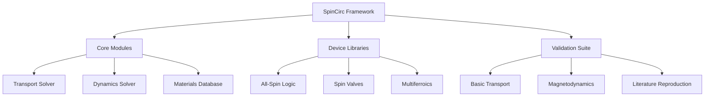

# SpinCirc: Advanced Spin Transport Circuit Framework

!!! info "Framework Overview"
    A comprehensive cross-platform MATLAB/Python/Verilog-A scientific computing framework for computational spintronics and magnetodynamics — implemented in MATLAB, Python, and Verilog-A with Berkeley-themed visualization.

## Core Subject Areas

The SpinCirc framework provides complete implementations across these scientific domains:

=== "Spintronics"
    - Spin transport theory
    - Giant magnetoresistance (GMR)
    - Tunnel magnetoresistance (TMR)
    - Spin diffusion equations

=== "Magnetodynamics" 
    - Landau-Lifshitz-Gilbert (LLG) equations
    - Landau-Lifshitz-Gilbert-Slonczewski (LLGS) equations
    - Spin-transfer torque (STT) effects
    - Spin-orbit torque (SOT) effects

=== "Device Physics"
    - All-spin logic (ASL) devices
    - Spin valve architectures
    - Multiferroic devices
    - SOT switching devices

=== "Circuit Modeling"
    - 4×4 conductance matrix formalism
    - F/N/F heterostructure modeling
    - Interface physics implementation
    - Frequency-domain analysis

=== "Numerical Methods"
    - Adaptive integration schemes
    - Parallel computing implementation
    - Monte Carlo analysis
    - GPU acceleration

=== "Visualization"
    - Berkeley institutional color schemes
    - 3D magnetization trajectory plots
    - Publication-quality figure generation

## Quick Navigation



## Getting Started

### Prerequisites

!!! requirements "System Requirements"
    - **MATLAB R2024b+** with required toolboxes
    - **Python 3.9+** with scientific computing stack
    - **Git** for version control

### Installation

```bash title="Clone Repository"
git clone https://github.com/alaweimm90/SpinCirc.git
cd SpinCirc
```

```matlab title="MATLAB Setup"
% Add to MATLAB path
addpath(genpath('matlab'));

% Apply Berkeley styling
berkeley();

% Verify installation
runtests('matlab/tests');
```

### Basic Usage Example

```matlab title="Basic Spin Transport Simulation"
% Create transport solver
solver = SpinTransportSolver();

% Set geometry (length, width, thickness in meters)
solver.setGeometry(200e-9, 100e-9, 2e-9);

% Define F/N/F heterostructure
materials = [MaterialsDB.CoFeB, MaterialsDB.Cu, MaterialsDB.CoFeB];
solver.setMaterials(materials);

% Set parallel magnetization configuration
magnetization = [1, 0, 0; 1, 0, 0];
solver.setMagnetization(magnetization);

% Apply boundary conditions
bc_values = struct('node', [1, 3], 'voltage', [1, 0]);
solver.setBoundaryConditions('voltage', bc_values);

% Solve transport equations
[V, I_s, info] = solver.solve('verbose', true);

% Visualize results
solver.plotSolution('component', 'charge');
```

## Scientific Modules Reference

### Core Transport Engine

| Component | Description | Key Methods |
|-----------|-------------|-------------|
| `SpinTransportSolver` | Master transport solver with 4×4 formalism | `solve()`, `setGeometry()`, `setMaterials()` |
| `ConductanceMatrix` | F/N/F interface physics implementation | `generateMatrix()`, `applyRotation()` |
| `MaterialsDB` | Comprehensive material parameter database | `getProperties()`, `getTemperatureDependence()` |

### Magnetodynamics Solvers

| Solver | Integration Schemes | Special Features |
|--------|-------------------|------------------|
| `LLGSolver` | RK4, RK45, Dormand-Prince, IMEX | Energy conservation, adaptive timestep |
| `LLGSSolver` | Self-consistent coupling | STT/SOT effects, spin pumping |

### Device Libraries

| Device Type | Implementation | Validation Examples |
|-------------|----------------|-------------------|
| All-Spin Logic | `ASLInverter.m` | Transient response, switching dynamics |
| Spin Valves | `NonlocalSpinValve.m` | NLSV characteristics, GMR/TMR |
| Multiferroics | `VoltageControlledMagnet.m` | Voltage-controlled switching |

## Performance Benchmarks

!!! performance "Computational Performance"
    - **Large-scale simulations**: GPU acceleration with CUDA support
    - **Parallel computing**: MATLAB Parallel Computing Toolbox integration  
    - **Memory optimization**: Efficient algorithms for complex systems
    - **Adaptive meshing**: Smart spatial discretization for accuracy

## Testing Framework

The SpinCirc framework includes comprehensive validation:

```matlab title="Run Test Suite"
% Execute all tests
results = runtests('matlab/tests', 'IncludeSubfolders', true);

% Generate detailed report
results = runtests('matlab/tests', 'OutputDetail', 'Detailed');
```

### Test Coverage Areas

- [x] Conductance matrix properties and current conservation
- [x] Energy conservation in magnetodynamics simulations
- [x] Material parameter validation and consistency checks
- [x] Interface modeling accuracy verification
- [x] Performance benchmarking and memory optimization
- [x] Stochastic dynamics validation

### Validation Examples

!!! example "20+ Comprehensive Examples"
    
    **Basic Transport**
    
    - 1D spin diffusion: Analytical vs. numerical validation
    - Hanle precession: Spin dephasing under transverse fields
    - Interface resistance: F/N interface characterization
    
    **Magnetodynamics**
    
    - LLG precession: Energy and magnitude conservation
    - Hysteresis loops: Quasi-static switching characterization
    - STT switching: Current-driven magnetization reversal
    
    **Literature Reproduction**
    
    - ASL transient response (Manipatruni et al. Nature Physics 2015)
    - NLSV characteristics (Johnson & Silsbee validation)
    - TMR bias dependence (Simmons model validation)

## API Documentation

### Core Classes

::: matlab.core.transport.SpinTransportSolver
    :docstring:

::: matlab.core.dynamics.LLGSolver
    :docstring:

::: matlab.core.materials.MaterialsDB
    :docstring:

## Educational Resources

### Tutorial Notebooks

1. **[Quick Start Guide](examples/quick_start.m)** - Basic framework usage
2. **[Transport Fundamentals](examples/transport_tutorial.m)** - Spin transport theory
3. **[Magnetization Dynamics](examples/dynamics_tutorial.m)** - LLG equation solving
4. **[Device Modeling](examples/device_tutorial.m)** - ASL and spin valve design

### Advanced Examples

- **Monte Carlo Analysis** - Statistical device characterization
- **Parameter Optimization** - Design space exploration
- **Parallel Computing** - Large-scale simulation techniques

## Development Guide

### Repository Structure

```
SpinCirc/
├── matlab/                     # Core MATLAB framework
│   ├── core/                   # Physics engines
│   │   ├── transport/          # 4×4 conductance matrices  
│   │   ├── dynamics/           # LLG/LLGS solvers
│   │   ├── materials/          # Material databases
│   │   └── numerical/          # Numerical methods
│   ├── devices/                # Device implementations
│   ├── validation/             # Validation examples
│   ├── style/                  # Berkeley plotting theme
│   └── tests/                  # Unit test suite
├── python/                     # Python analysis tools
├── verilogA/                   # SPICE compact models
├── docs/                       # Documentation source
├── examples/                   # Tutorial notebooks
└── data/                       # Reference datasets
```

### Contributing Guidelines

!!! contribute "How to Contribute"
    
    1. **Fork** the repository on GitHub
    2. **Create** a feature branch (`git checkout -b feature/AmazingFeature`)
    3. **Make** your changes with appropriate tests
    4. **Test** your changes (`matlab -batch "runtests('matlab/tests')"`)
    5. **Commit** your changes (`git commit -m 'Add AmazingFeature'`)
    6. **Push** to your branch (`git push origin feature/AmazingFeature`)
    7. **Open** a Pull Request

## Citation Guidelines

For academic publications using SpinCirc:

```bibtex
@article{alawein2018circuit,
  title={Circuit Models for Spintronic Devices Subject to Electric and Magnetic Fields},
  author={Alawein, Meshal and Fariborzi, Hamid},
  journal={IEEE Journal on Exploratory Solid-State Computational Devices and Circuits},
  volume={4},
  number={2},
  pages={76--85},
  year={2018},
  publisher={IEEE},
  doi={10.1109/JXCDC.2018.2848670}
}

@software{spincirc2025,
  title={SpinCirc: Advanced Spin Transport Circuit Framework},
  author={Alawein, Dr. Meshal},
  year={2025},
  url={https://github.com/alaweimm90/SpinCirc},
  version={1.0.0}
}
```

## Author Information

**Dr. Meshal Alawein**  
*Principal Research Scientist*  
University of California, Berkeley

📧 [meshal@berkeley.edu](mailto:meshal@berkeley.edu)  
🌐 [Personal Website](https://malawein.com)  
🔬 [Research Platform](https://simcore.dev)  
🎓 [Google Scholar](https://scholar.google.com/citations?user=IB_E6GQAAAAJ&hl=en)

---

*Made with love, and a deep respect for the struggle. For those still learning—from someone who still is. Science can be hard. This is my way of helping.* ⚛️